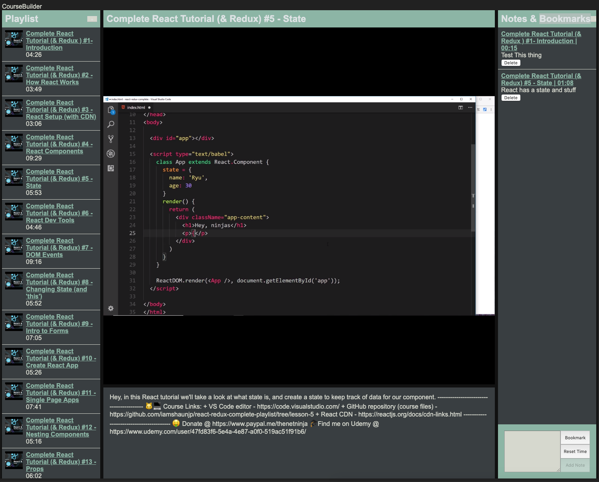

# `videojs-react-course-assistant`

A course assistant tool similar to coursera or frontend masters, built using React, Linaria and VideoJS.

WIP https://react-coursebuilder.netlify.com/ (please don't abuse the API key)

## Features

- Fetches playlists from YouTube API
- Autoplays through tracks
- Takes time stamped notes and bookmarks
- Sets time for note automatically based on start time of note
- Somewhat responsive layout (untested)
- Saves notes and fetched playlists to localStorage
- Allows downloading of notes in JSON format

Uses dotenv, please copy the .env.template and to .env and use a valid API key for youtube. Initial load will not fire a youtube request but uses preloaded data.

## Initial Goals

- [x] Use clean webpack configuration (i.e. no create react app)
- [x] Play with Linaria :D
- [x] VideoJS running okay with context actions
- [x] Use react context for sharing notes and details (probably unnecessary tbh)
- [x] Fetches a youtube playlist with sufficient data (working, needs playlist title)
- [x] Autoplays through playlist
- [x] Takes notes and bookmarks with correct timestamping (context handling added, bookmark = empty note)
- [x] Saves notes relative to a specific playlist to localStorage (should be working once integrated)
- [x] Mobile view (lazy initial effort)
- [x] Download notes in a friendly format (csv? Json? what's good?)
- [ ] Dont allow notes with same timestamp (no 0.000 options?)

## Further afield

See [TODO.md](./TODO.md), contributions are strongly encouraged as I'm unlikely to ever get to adding everything that could be added

### Notes

- This current buid depends on the videojs cdn loading
- core-js handled to temporarily resolve linaria issues
- To minimise API requests, only the playlist ID is known, meaning the playlist is hard to identify
